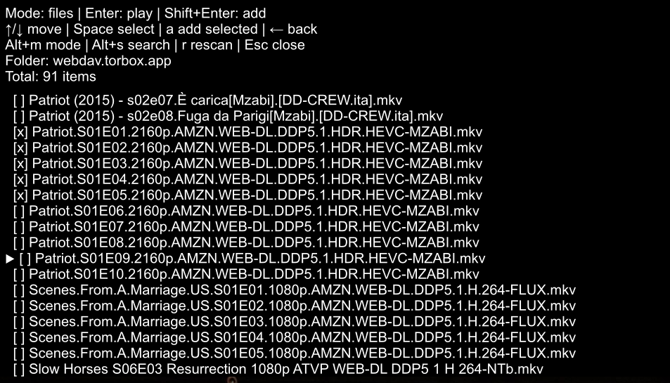

# WebDAV Loader for mpv

An interactive WebDAV browser for [mpv](https://mpv.io/), written in Lua.

The script lets you browse remote WebDAV storage, navigate folders, search files, play media, and append files directly to the mpv playlist.

It is designed for standard HTTPS WebDAV services and can be used with providers such as TorBox, Premiumize, Real-Debrid, self-hosted WebDAV servers, NAS devices, and other compatible services.



## Features

- Browse WebDAV folders interactively from mpv.
- Play files directly from WebDAV.
- Add individual files to the mpv playlist.
- Select and add multiple files at once.
- Recursive file mode for searching the complete WebDAV library.
- Folder mode for normal directory navigation.
- Back navigation with `Backspace` or `Left`.
- Search by filename.
- Persistent `[a]` markers for files already added to the playlist.
- Persistent selection state while switching between modes and folders.
- Duplicate-add prevention.
- Configurable media-file extensions.
- Configurable recursive scan depth.
- HTTPS Basic Authentication.
- Asynchronous WebDAV scans using `curl.exe`.
- No external Lua libraries required.

## Requirements

- mpv with Lua script support.
- `curl.exe` available on `PATH`.
- A WebDAV server reachable over HTTP or HTTPS.
- Valid WebDAV credentials.

### Windows

Windows 10 and Windows 11 normally include `curl.exe`.

Test it from PowerShell:

```powershell
curl.exe --version
```

If the command is not found, install curl and add its directory to `PATH`.

### Linux and macOS

The script currently calls `curl.exe`. On Linux or macOS, either:

- create a compatible command named `curl.exe`, or
- change `"curl.exe"` in the Lua script to `"curl"`.

## Installation

### Windows

Copy `mpv-webdav-loader.lua` to:

```text
%APPDATA%\mpv\scripts\mpv-webdav-loader.lua
```

The complete path usually looks like:

```text
C:\Users\YourName\AppData\Roaming\mpv\scripts\mpv-webdav-loader.lua
```

### Linux

Copy the script to:

```text
~/.config/mpv/scripts/mpv-webdav-loader.lua
```

### macOS

Copy the script to:

```text
~/Library/Application Support/mpv/scripts/mpv-webdav-loader.lua
```

Create the `scripts` directory if it does not already exist.

## Configuration

Create a file named `mpv-webdav-loader.conf` in the `script-opts` directory.

### Windows

```text
%APPDATA%\mpv\script-opts\mpv-webdav-loader.conf
```

### Linux

```text
~/.config/mpv/script-opts/mpv-webdav-loader.conf
```

### macOS

```text
~/Library/Application Support/mpv/script-opts/mpv-webdav-loader.conf
```

Example configuration:

```ini
url=https://webdav.example.com/
user=your-username
pass=your-password-or-api-key
key=ctrl+w
max_depth=6
extensions=mkv,mp4,avi,mov,webm,ts,m2ts,flv,wmv,mp3,flac,aac,ogg,m4a,wav,m3u8
```

### Configuration options

| Option | Description | Default |
|---|---|---|
| `url` | WebDAV server URL | `https://webdav.torbox.app/` |
| `user` | WebDAV username | `your-email@example.com` |
| `pass` | WebDAV password, token, or API key | Empty |
| `key` | Key used to open the browser | `ctrl+w` |
| `max_depth` | Maximum recursive scan depth | `6` |
| `extensions` | Comma-separated list of accepted file extensions | See example above |

Keep the configuration file private. It contains credentials.

## Usage

Start mpv, then press the configured key, which is `Ctrl+W` by default.

The script opens in file mode and recursively scans the WebDAV library.

### Browser controls

| Key | Action |
|---|---|
| `Up` / `Down` | Move the cursor |
| `Page Up` / `Page Down` | Move ten items |
| `Home` / `End` | Move to the first or last item |
| `Enter` | Play a file or open a folder |
| `Shift+Enter` | Add the current file, add selected files, or open a folder |
| `Space` | Select or deselect a file |
| `a` | Add all selected files to the playlist |
| `Backspace` / `Left` | Go to the previous folder |
| `Alt+M` | Switch between file mode and folder mode |
| `Alt+S` | Start filename search |
| `Backspace` while searching | Delete the last search character |
| `Ctrl+Backspace` while searching | Clear the search query |
| `Enter` while searching | Confirm the search |
| `Esc` while searching | Cancel the search |
| `r` | Rescan the current scope |
| `Esc` | Close the browser |

## Operating modes

### File mode

File mode recursively scans the WebDAV server up to `max_depth` and displays all supported media files in one list.

Use it when you want to search the complete library or quickly find media without navigating folders manually.

### Folder mode

Folder mode displays the folders and files inside the current directory.

Use `Enter` on a directory to open it. Press `Backspace` or `Left` to return to the previous directory.

### Status markers

| Marker | Meaning |
|---|---|
| `[ ]` | Normal file |
| `[x]` | Selected file |
| `[a]` | Already added to the mpv playlist |
| `[D]` | Directory |

The `[a]` state is keyed by the complete file URL, so it remains available when switching between folder mode and file mode.

## Provider examples

### TorBox

```ini
url=https://webdav.torbox.app/
user=torbox
pass=YOUR_TORBOX_API_KEY
key=ctrl+w
max_depth=6
extensions=mkv,mp4,avi,mov,webm,ts,m2ts,flv,wmv,mp3,flac,aac,ogg,m4a,wav,m3u8
```

TorBox may also support the account username and password depending on the account configuration. Use the credentials specified by the provider.

### Premiumize

```ini
url=https://webdav.premiumize.me/
user=YOUR_CUSTOMER_ID
pass=YOUR_API_KEY
key=ctrl+w
max_depth=6
extensions=mkv,mp4,avi,mov,webm,ts,m2ts,flv,wmv,mp3,flac,aac,ogg,m4a,wav,m3u8
```

### Real-Debrid

```ini
url=https://dav.real-debrid.com/
user=YOUR_WEBDAV_USERNAME
pass=YOUR_WEBDAV_PASSWORD
key=ctrl+w
max_depth=6
extensions=mkv,mp4,avi,mov,webm,ts,m2ts,flv,wmv,mp3,flac,aac,ogg,m4a,wav,m3u8
```

Real-Debrid may use separate WebDAV credentials. Do not automatically assume that the normal account password is the WebDAV password.

### Generic WebDAV

```ini
url=https://your-server.example.com/remote.php/dav/files/username/
user=your-username
pass=your-password-or-app-token
key=ctrl+w
max_depth=6
extensions=mkv,mp4,avi,mov,webm,ts,m2ts,flv,wmv,mp3,flac,aac,ogg,m4a,wav,m3u8
```

For services such as Nextcloud, an app password is usually preferable to the main account password.

## Security notes

The script uses HTTP Basic Authentication through curl and embeds credentials into the playback URL for mpv.

This has several implications:

- Use HTTPS whenever possible.
- Do not share your `mpv-webdav-loader.conf` file publicly.
- Do not commit credentials to Git.
- Use an API key, app password, or restricted token when available.
- Rotate credentials if they are accidentally exposed.
- Avoid using `-k` or `--insecure` unless you intentionally accept invalid TLS certificates.

The script does not currently implement a secure credential store.

## Troubleshooting

### The browser does not open

Check that:

1. The script is in the correct mpv `scripts` directory.
2. The configuration file is in the correct `script-opts` directory.
3. `curl.exe --version` works from a terminal.
4. The username and password are not still set to their example values.
5. mpv's console does not show a Lua error.

### Authentication failed

Verify:

- The WebDAV URL.
- The username format required by the provider.
- Whether the provider requires an API key instead of a password.
- Whether the provider requires a separate WebDAV password.

Try a direct request from PowerShell:

```powershell
curl.exe -u "USERNAME:PASSWORD" -X PROPFIND -H "Depth: 1" "https://webdav.example.com/"
```

Do not paste real credentials into public issue reports or screenshots.

### Files appear but do not play

Check whether the direct file URL works with curl or a WebDAV client. Possible causes include:

- The provider does not allow direct streaming.
- The file URL contains unusual characters.
- The provider requires a different authentication method.
- The file is not actually available yet.
- The URL uses a temporary or expired access token.

### Some folders are missing

Increase `max_depth`:

```ini
max_depth=10
```

A larger value can produce more requests and increase scan time on large libraries.

### Some media files are missing

Add their extensions to the configuration:

```ini
extensions=mkv,mp4,avi,mov,webm,ts,m2ts,flv,wmv,mp3,flac,aac,ogg,m4a,wav,m3u8,iso
```

### Folder names look incorrectly encoded

The script decodes percent-encoded URL characters, including UTF-8 path bytes. If a provider returns malformed URLs, the displayed name or playback URL may still be incorrect.

### Scanning is slow

Recursive mode performs a WebDAV request for each scanned folder. For large libraries:

- Use folder mode for manual navigation.
- Lower `max_depth`.
- Use a narrower extension list.
- Avoid repeatedly rescanning the complete library.

## Limitations

- The script is currently read-only from the WebDAV perspective.
- It does not upload, delete, rename, or create folders.
- It requires Basic Authentication through curl.
- Search is filename-based and case-insensitive.
- The recursive scanner depends on the WebDAV server returning valid `PROPFIND` XML.
- Some providers refresh or expose newly added files with a delay.
- Credentials are currently passed to curl and may be visible to local process inspection while a request is running.


## License

MIT License. See [LICENSE](LICENSE).

## Contributing

Bug reports and improvements are welcome.

When reporting a problem, include:

- Operating system.
- mpv version.
- WebDAV provider.
- Relevant mpv console output.
- A sanitized configuration example.
- The steps needed to reproduce the problem.

Never include passwords, API keys, session cookies, or private WebDAV URLs in an issue.
